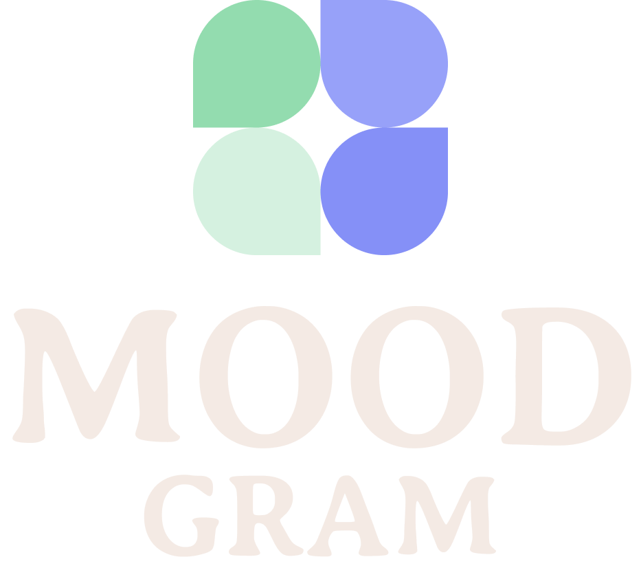
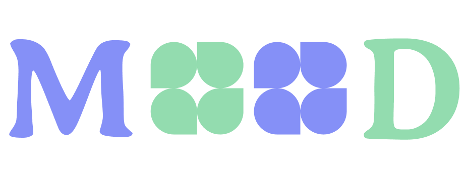

  

  <h2>🍃 MOODGram - Descubra o humor por trás das palavras 🍂</h2>

  
  

## 📃 Descrição da Temática

Análise de sentimentos é o processo de analisar um texto digital para determinar se o tom emocional da mensagem é positivo, negativo ou neutro. Atualmente, as empresas têm grandes volumes de dados textuais, como e-mails, transcrições de chat de atendimento ao cliente, comentários em mídias sociais e avaliações. As ferramentas de análise de sentimentos podem escanear esse texto para determinar automaticamente a atitude do autor em relação a um tópico. As empresas usam os insights da análise de sentimentos para melhorar o atendimento ao cliente e aumentar a reputação da marca.

  

Dito isso, o objetivo central consiste em desenvolver classificador de sentimentos de notícias eficiente, preciso e escalável. O modelo criado pelos times deve ser capaz de analisar o texto de uma notícia e determinar se o sentimento geral associado a ela é positivo, negativo ou neutro. A partir dessa classificação, uma empresa do segmento financeiro poderá tomar decisões informadas e estratégicas com base em dados confiáveis sobre a percepção pública de notícias relevantes.

  

## 📃 Documentos do Projeto

- Clique no link para acessar: [🔗 Documento de Especificação do Projeto](https://drive.google.com/file/d/14aKYnBnIVCiR-CyrNCAREyv1dtlKJMaq/preview)

## 🖌️ Protótipos de Interface

- Clique no link para acessar: [🔗 Link para o Figma](https://www.figma.com/file/I7dS63C0gmyqKB69vWiEn6/MOODGram---Dashboard?type=design&node-id=10%3A747&mode=design&t=CQ1BB3gFdLGHzK5J-1)

## ✅ To-do

* [X] [Escrever a Solução Proposta da Documentação](https://github.com/zairobastos/moodgram/issues/13)
* [X] [Segunda Reunião - Andamento das Atividades](https://github.com/zairobastos/moodgram/issues/11)
* [X] [Primeira Reunião - Debate sobre o Tema](https://github.com/zairobastos/moodgram/issues/10)
* [X] [Escrever a Introdução da Documentação](https://github.com/zairobastos/moodgram/issues/9)
* [X] [Análise Exploratória dos Dados](https://github.com/zairobastos/moodgram/issues/4)
* [X] [Prototipagem das Telas da Aplicação WEB](https://github.com/zairobastos/moodgram/issues/3)
* [X] [Tratamento dos Dados](https://github.com/zairobastos/moodgram/issues/1)
* [X] [Finalizar a API de conexão com a aplicação](https://github.com/zairobastos/moodgram/issues/16)
* [X] [Escrever o Pré-processamento dos Dados da Documentação](https://github.com/zairobastos/moodgram/issues/15)
* [X] [Escrever a Descrição dos Dados da Documentação](https://github.com/zairobastos/moodgram/issues/14)
* [ ] [Terceira Reunião - Teste Pré-Apresentação](https://github.com/zairobastos/moodgram/issues/12)
* [X] [Documentação no Repositório GitHub](https://github.com/zairobastos/moodgram/issues/8)
* [X] [Validação dos Resultados e Performance do Algoritmo](https://github.com/zairobastos/moodgram/issues/7)
* [X] [Análise de Importância de Variáveis e Interpretabilidade](https://github.com/zairobastos/moodgram/issues/6)
* [X] [Seleção, Treinamento e Otimização de Algoritmo](https://github.com/zairobastos/moodgram/issues/5)
* [X] [Escrever a Introdução da Documentação](https://github.com/zairobastos/moodgram/issues/2)

## 🛠 Tecnologias

- Figma - Utilizado na prototipação das telas
- GIT - Versionamento do código
- Pandas - Utilizado no processo de manipulação dos dados
- Numpy - Utilizado para operações matemáticas

## 👨‍💻👩‍💻 Desenvolvedores

<table align="center">
<tr>
  <td align="center"><a href="https://github.com/gabrielrudan"> <b>Gabriel Rudan</b></a> 
💻
</td>
  <td align="center"><a href="https://github.com/Raylander524"> <b>Raylander Marques</b></a> 
💻
</td>
  <td align="center"><a href="https://github.com/leh-torres"> <b>Letícia Torres</b></a> 
💻
</td>
  <td align="center"><a href="https://github.com/zairobastos"> <b>Zairo Bastos</b></a> 
💻
</td>
